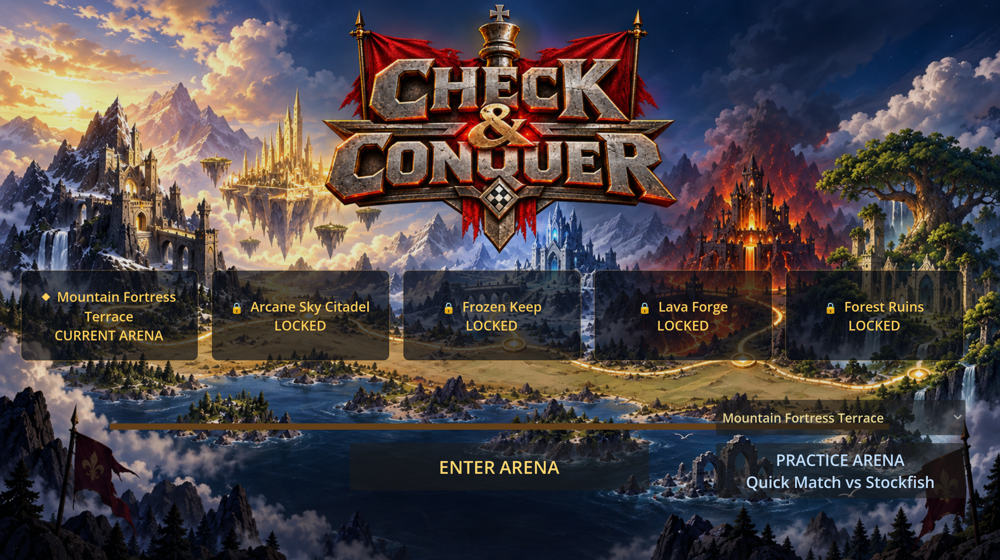
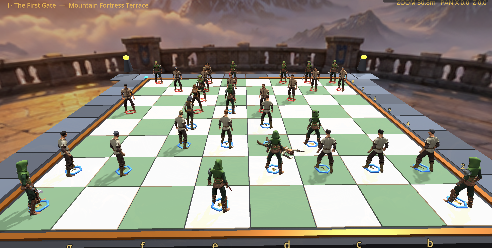

# Check & Conquer

**Check & Conquer** is an original 3D chess game where every legal move plays out on a living battlefield. Chess rules remain authoritative; animated duels give captures their drama.

  

[](https://github.com/joega/check-and-conquer/actions/workflows/test.yml)

## See it in action

### The Warpath



### The battlefield



## What you can play today

- A complete local chess rules engine: legal move validation, castling, en passant, promotion, checkmate, draws, FEN, and UCI moves.
- Play versus Stockfish 19, with selectable side and beginner-to-master campaign difficulty that rises gradually by arena, plus a Stockfish-versus-Stockfish spectator mode.
- A five-stop campaign route: win Mountain Fortress Terrace, Arcane Sky Citadel, Frozen Keep, and Lava Forge to unlock the final Forest Ruins match.
- An animated 3D board with six readable fantasy archetypes, full outfits, detailed faces, role-specific hair, and distinct weapons.
- Walk animations for ordinary moves and cinematic capture choreography with impact effects, death reactions, and camera framing.
- A stable player-side board view that remains behind the human player while Stockfish moves across the board. Five themed grand arenas use original generated 360° panoramas, local stone terraces, and arena-specific lighting. Right-drag orbits, middle-drag pans to any character, and the mouse wheel zooms to face level.
- Post-game move review and one-click PGN copy built from authoritative snapshots, plus debug scenes for replaying combat, browsing animations, and rebuilding the board from a FEN position.

Check & Conquer is early in development. The focus is a polished offline desktop prototype before any distribution features are considered.

## Download and play

Download the package for your platform from the
[Latest development build](https://github.com/joega/check-and-conquer/releases/tag/continuous),
extract it, and run the game executable from the extracted folder:

- **Windows:** `check-and-conquer.exe`
- **Linux:** `check-and-conquer.x86_64`

Each package already includes the correct Stockfish engine, GPL notice, and
corresponding source. No separate engine download, Godot installation, or
first-launch update is needed.

## Run from source

### Requirements

- [Godot 4.7.2](https://godotengine.org/download/archive/4.7.2-stable/)
- Linux or Windows
- A local Stockfish 19 executable for the platform being run

The Stockfish executable is excluded from Git because of its size. To run a
source checkout locally, download the matching official build from the
[Stockfish download page](https://stockfishchess.org/download/):

- Linux x86-64 universal: `third_party/stockfish/linux-x86_64/stockfish/stockfish-linux-x86-64-universal`
- Windows x86-64 universal: `third_party/stockfish/windows-x86_64/stockfish/stockfish-windows-x86-64-universal.exe`

Keep Stockfish's `Copying.txt` and corresponding source tree in
`third_party/stockfish/linux-x86_64/stockfish/`; both platform exporters stage
that GPL material beside their platform-specific binary.

Open the project in Godot or run:

```sh
godot --path .
```

The game opens directly on **The Warpath**. Win the current arena to unlock the next location, then select it from the campaign route. **Practice Arena** on the lower right starts a Quick Match versus Stockfish without advancing the route; the current developer tools sit on the lower left. Select a piece and then a highlighted square to move it. The board stays clear during play; the full-width **Menu** contains restart, undo, controls, side, campaign difficulty, spectator mode, promotion, animation speed, audio, fullscreen, and engine diagnostics. Each arena has an original procedural music bed, and board landings plus sword, spear, bow, arcane, hammer, and wall attacks have distinct effects.

## Development

Run the deterministic test suite, including chess perft and the real Stockfish subprocess test:

```sh
bash tools/run_headless_tests.sh
```

GitHub Actions runs the same suite on pushes and pull requests. It compiles the
committed Stockfish source into a temporary CI executable, so the real engine
integration remains covered without committing the large platform binary.

Create a Linux export with Godot's matching export templates installed:

```sh
bash tools/export_linux.sh
```

The exporter creates `build/linux-x86_64/` and places Stockfish beside the game executable so Godot can launch it as a UCI process.

Create a Windows x86-64 export after placing the Windows Stockfish archive at
the path above:

```sh
bash tools/export_windows.sh
```

This produces `build/windows-x86_64/` with the Windows executable, Stockfish,
the corresponding source, and license notices.

## Design principles

- Standard chess rules decide every outcome. The combat layer is presentation only.
- The pure chess domain owns the game state; 3D actors can be rebuilt from it at any time.
- Stockfish is an isolated UCI subprocess whose moves are independently validated before use.
- Every capture pairing has a generic fallback before bespoke choreography is added.
- Campaign progress is a small pure game-layer model. Arena visuals are presentation-only, so every standard chess match remains rebuildable and portable between locations.
- Check & Conquer uses original presentation and does not reproduce art, animations, audio, UI, or branding from any existing chess-combat game.

## Credits and licenses

Character models, outfits, and animation source packs are by [Quaternius](https://quaternius.com/) under CC0 1.0. The bundled chess engine is [Stockfish](https://stockfishchess.org/), distributed under GPLv3; its executable, source, and notices are staged with Linux exports. Godot is MIT licensed.

See [third-party asset provenance](assets/THIRD_PARTY_ASSETS.md) and [third-party software notices](docs/THIRD_PARTY_SOFTWARE.md) for the complete record.

## Project status

The playable prototype has passed chess perft through depth 4, real-process Stockfish integration, repeatable combat reset checks, and a Linux export smoke launch. Current development is focused on visual polish, camera/input refinement, and human release review.

## Contributing

This project is currently developed in public while the prototype takes shape. Issues and pull requests are welcome when they preserve the separation between chess rules, engine integration, gameplay orchestration, and presentation.
